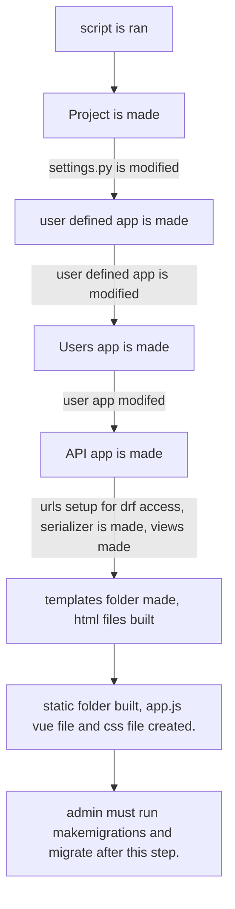

# Welcome to the Django helper tool

Hey there, I don't start my new job for a few days so I'm tackling some projects that I've had on the back burner. I love working with Django but hate doing the same boilerplate setup every time. 

## The goal of this script

 - Generate a project
 - Modify the urls and settings files for the project
 - Setup a simple app
 - Setup a user-app
 - Setup the urls, extend the user model, and prepare the views & forms
 - Setup a basic skeleton of a django-rest-framework including it's views
 - Serializers, and urls for a current user function and user-base DRF url 
 - Setup both the shared templates and static folders
 - Build the base html file and extend that base to an index file
 - Link to the CDN of Axios and Vue 
 - Setup the skeleton of a Vue app

# How to run

Once you have the files in the **root of where you want the project** enter the following into any terminal: 
 `'Python3 django_helper.py project_name app_name mac'` for mac 
 or 
 `'Python django_helper.py project_name app_name windows'` for windows. 

## The flow of the script

> **Note:** This graph absolutly failed to format how I thought it would... 

## Proposed additions 

Over time I would like to add the optional argument to change the framework from Vue to react/etc as well as adjust names of the users/api apps. It would also be nice to offer a more traditional option of django project that hosts and serves all the data via class or function based views for beginner projects, DRF might be off putting for newer users of Django. 

